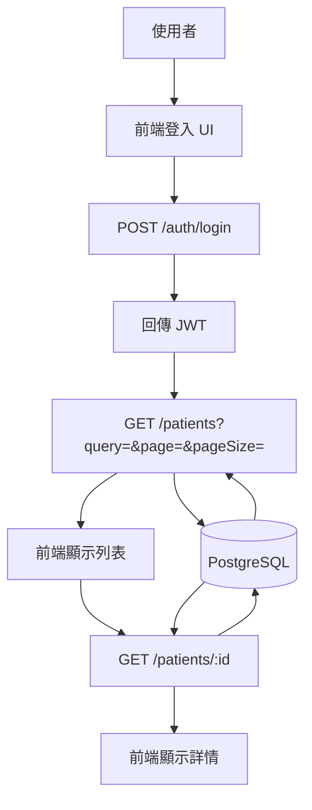

# 登入與病人查詢流程（JWT + PostgreSQL）

本文件說明前端登入後，以 JWT 呼叫後端 API 查詢病人資料的流程與資料流。

## 流程圖（Mermaid）

## 資料流（Data Flow）

1. 使用者輸入 Email / Password。
2. 前端呼叫 `POST /auth/login`。
3. 後端驗證帳密，回傳 JWT。
4. 前端帶 `Authorization: Bearer <token>` 呼叫 `GET /patients`。
5. 後端查詢 PostgreSQL，回傳列表與分頁資訊。
6. 使用者點擊某筆資料時，呼叫 `GET /patients/:id`。
7. 後端回傳詳細資料。

## API 一覽

- `POST /auth/login`
  - Body: `{ email, password }`
  - Response: `{ token, user }`

- `GET /patients`
  - Query: `query`, `page`, `pageSize`, `sort`, `order`
  - Response: `{ items, page, pageSize, total }`

- `GET /patients/:id`
  - Response: `{ id, name, id_number, passport_number, manual_code, nfc_code, financial_source, created_at }`

## Use Cases

### UC1：醫護登入並查詢病人列表

- Actor：醫護人員
- 前置條件：帳號已建立；病人資料已匯入
- 流程：登入 → 查詢 → 顯示列表
- 結果：顯示病人列表與分頁

### UC2：查詢單筆病人資料

- Actor：醫護人員
- 流程：登入 → 查詢 → 點選病人
- 結果：顯示病人詳細資料

### UC3：未登入查詢

- Actor：未登入使用者
- 流程：直接呼叫 API
- 結果：後端回 401

