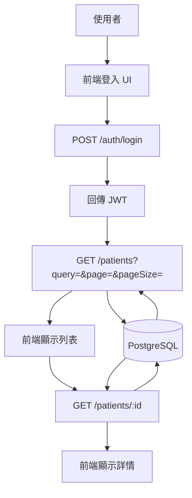
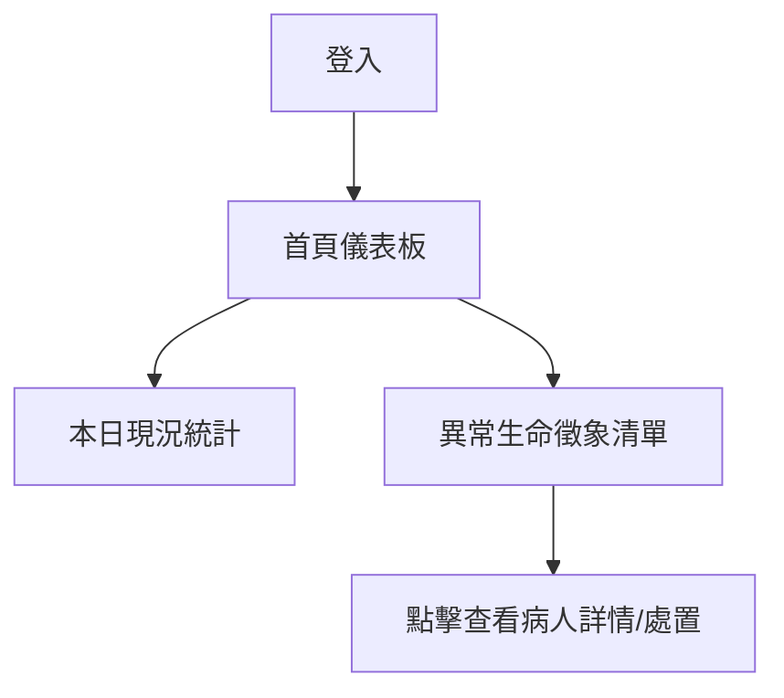
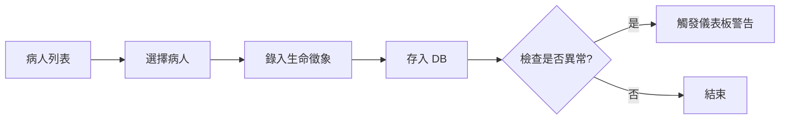
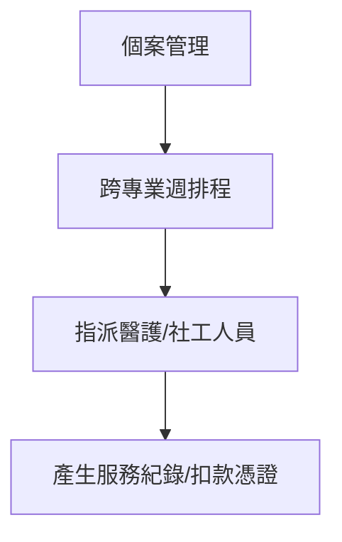

# 登入與病人查詢流程（JWT + PostgreSQL）

本文件說明前端登入後，以 JWT 呼叫後端 API 查詢病人資料的流程與資料流。

## 流程圖（Mermaid）

## 資料流（Data Flow）

1. 使用者輸入 Email / Password。
2. 前端呼叫 `POST /auth/login`。
3. 後端驗證帳密，回傳 JWT。
4. 前端帶 `Authorization: Bearer <token>` 呼叫 `GET /patients`。
5. 後端查詢 PostgreSQL，回傳列表與分頁資訊。
6. 使用者點擊某筆資料時，呼叫 `GET /patients/:id`。
7. 後端回傳詳細資料。

## API 一覽

- `POST /auth/login`
  - Body: `{ email, password }`
  - Response: `{ token, user }`

- `GET /patients`
  - Query: `query`, `page`, `pageSize`, `sort`, `order`
  - Response: `{ items, page, pageSize, total }`

- `GET /patients/:id`
  - Response: `{ id, name, id_number, passport_number, manual_code, nfc_code, financial_source, created_at }`

- `GET /stats/daily` (新增)
  - Response: `{ admissionCount, attendanceCount, abnormalVitalSigns: [...] }`
- `POST /medical-records/vital-signs` (新增)
  - Body: `{ patientId, temperature, pulse, respiration, bp_systolic, bp_diastolic, spo2 }`
- **前端整合**：同時存在 `clinic-frontend` 與 `clinic-frontend-jwt` 顯示未來可以考慮將其整合為單一應用程式，並透過環境變數進行切換。
- **資料庫完善**：`medical-server-jwt` 是目前最完整的後端組件，具備真實的資料庫查詢與生產環境模式（如 Bcrypt 加密、連線池等）。
- **上線策略**：需要決定最終採用 Firebase（開發速度快、代管基礎設施）還是自定義 Node.js/PostgreSQL 架構（掌控度高、便於與國網中心本地系統接軌）。

## 系統擴展流程（基於舊系統截圖分析）

### 1. 儀表板與異常警戒流程

醫護人員登入後，首頁應顯示「本日現況」與「異常生命徵象」。

### 2. 生理數據紀錄流程

長照系統核心在於持續追蹤。

### 3. 跨專業排程管理

舊系統中有複雜的週排程表。

## 建議增加的功能（待確認）

根據「頁面截圖」資料夾內的分析，目前的流程圖建議增加以下部分：

1.  **首頁統計模組**：收案人數、出席人數、請假人數統計。
2.  **生命徵象警戒**：體溫、脈搏、血壓、血氧的異常自動標記。
3.  **交通接送管理**：追蹤病患的到院與返家司機資訊。
4.  **CMS 等級異動提示**：病患個案分級的變動通知。
5.  **跨專業服務紀錄**：整合社工、護理、復健、照顧等不同專業的服務清單。

## Use Cases (新增)

### UC4：儀表板即時監控

- Actor：值班護理師
- 流程：登入 → 首頁 → 檢視今日異常提醒
- 結果：即時發現生命徵象不穩之病患

### UC5：跨專業服務分配

- Actor：個管員
- 流程：選擇病患 → 進入週排程 → 分派不同專業人員（如社工 GA03）
- 結果：生成當週服務計畫

## Use Cases

### UC1：醫護登入並查詢病人列表

- Actor：醫務人員
- 前置條件：帳號已建立；病人資料已匯入
- 流程：登入 → 查詢 → 顯示列表
- 結果：顯示病人列表與分頁

### UC2：查詢單筆病人資料

- Actor：醫護人員
- 流程：登入 → 查詢 → 點選病人
- 結果：顯示病人詳細資料

### UC3：未登入查詢

- Actor：未登入使用者
- 流程：直接呼叫 API
- 結果：後端回 401
