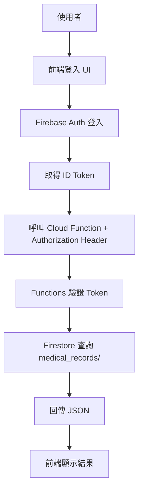

# 醫病安全查詢系統：登入與查詢流程說明

本文件說明目前「前端登入 → 取得 Token → 呼叫後端 → Firestore 查詢」的實作流程。

## 專案與元件對應

- 前端：Vue 3 + Vite
  - `clinic-frontend/src/App.vue`
  - `clinic-frontend/src/main.js`
- 後端：Firebase Cloud Functions
  - `my-safe-app/functions/index.js`
- 資料庫：Firestore
  - 集合：`medical_records`

## 流程圖（Mermaid）



## 資料流（Data Flow）

1. 使用者在前端輸入 Email/Password。
2. 前端呼叫 Firebase Auth 進行登入。
3. 前端從 `currentUser.getIdToken()` 取得 ID Token。
4. 前端以 `Authorization: Bearer <token>` 呼叫 Cloud Function。
5. 後端驗證 Token，取得使用者 UID。
6. 後端讀取 `medical_records/<recordId>`，回傳 JSON。
7. 前端顯示查詢結果。

## 主要程式碼解釋

### 前端：登入與查詢

檔案：`clinic-frontend/src/App.vue`

- `login()`
  - 使用 `signInWithEmailAndPassword(auth, email, password)` 進行登入。
- `fetchData()`
  - `getIdToken()` 取得 ID Token。
  - 呼叫 `FUNCTION_URL`，並在 Header 放入 `Authorization`。

```js
const token = await user.getIdToken();
const res = await fetch(`${FUNCTION_URL}?id=${encodeURIComponent(recordId.value)}`, {
  headers: { Authorization: `Bearer ${token}` }
});
```

### 前端：Firebase 初始化與登入狀態

檔案：`clinic-frontend/src/main.js`

- `initializeApp(firebaseConfig)` 初始化 Firebase。
- `setPersistence(inMemoryPersistence)` 設定不保留登入狀態。

```js
const auth = getAuth();
setPersistence(auth, inMemoryPersistence);
```

### 後端：Token 驗證與 Firestore 查詢

檔案：`my-safe-app/functions/index.js`

- 從 `Authorization` 取得 token。
- `admin.auth().verifyIdToken(token)` 驗證使用者身分。
- 讀取 `medical_records` 集合。

```js
const idToken = req.headers.authorization?.split("Bearer ")[1];
await admin.auth().verifyIdToken(idToken);
const docRef = db.collection('medical_records').doc(recordId);
```

## Use Cases

### UC1：醫護登入並查詢病人資料

- Actor：醫護人員
- 前置條件：Firebase Auth 已建立測試帳號；Firestore 有資料
- 流程：登入 → 輸入 Document ID → 查詢 → 顯示結果
- 結果：顯示病人資料 JSON

### UC2：輸入不存在的 ID

- 流程：登入 → 輸入不存在的 ID → 查詢
- 結果：後端回 404，前端顯示錯誤

### UC3：未登入直接查詢

- 流程：未登入 → 查詢
- 結果：後端回 403，提示未授權

## 本機測試注意事項

- 前端需指向本機 Functions URL。
- Functions Emulator 需啟動並保持執行。
- 若改動 Functions 需重啟 Emulator。
